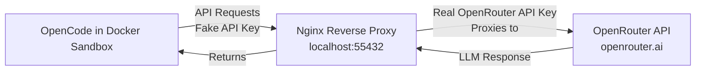

# opencode-openrouter-docker-sandbox

A secure way to run OpenCode with OpenRouter as a provider in a Docker Sandbox until official Docker support is added.

## Architecture



## Setup

### Start the nginx server
```shell
docker compose down
docker compose up -d
```

### Build the Sandbox
```shell
docker build -t opencode-openrouter-sandbox:v1 .
```

### Run the Sandbox
```shell
docker sandbox run -t opencode-openrouter-sandbox:v1 --name opencode-openrouter-sandbox opencode -- --model 'openrouter/google/gemini-3-flash-preview'
docker sandbox network proxy opencode-openrouter-sandbox --allow-host "localhost:55432"
```

## Helpful Commands

### Cleanup ALL Sandboxes
```shell
docker sandbox reset
```