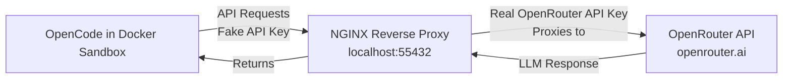

# opencode-openrouter-docker-sandbox

A secure way to run OpenCode with OpenRouter as a provider in a Docker Sandbox until official Docker support is added.

## Architecture



## Setup

### Start the NGINX server
```shell
docker compose down
docker compose up -d
```

### Build the Sandbox
```shell
docker build -t opencode-openrouter-sandbox:v1 .
```

### Run the Sandbox
```shell
# Navigate to the directory you wish to run OpenCode on
docker sandbox run -t opencode-openrouter-sandbox:v1 --name opencode-openrouter-sandbox opencode -- --model 'openrouter/google/gemini-3-flash-preview'
# In another terminal window, execute the following command to allow the sandbox to access the NGINX server
docker sandbox network proxy opencode-openrouter-sandbox --allow-host "localhost:55432"
```

## Helpful Commands

### Restrict Network Access
Significantly restrict network access to only essential services:
```shell
docker sandbox network proxy opencode-openrouter-sandbox --policy deny --allow-host "localhost:55432"
```

> [!WARNING]
> This heavily restricts network access but is not a true air-gap.
>
> Even with this deny policy, Docker maintains a default allowlist including package managers (npm, PyPI, RubyGems), version control (GitHub), and select AI service APIs.
>
> After applying the policy above, you can view the full up-to-date policy:
> ```powershell
> Get-Content "$env:USERPROFILE\.docker\sandboxes\vm\opencode-openrouter-sandbox\proxy-config.json" | ConvertFrom-Json | ConvertTo-Json
> ```

### Cleanup ALL Sandboxes
```shell
docker sandbox reset
```